# HSTS - High School Test System

[](https://github.com/najikay/hsts-v2/actions)
&nbsp;Java 21 · JavaFX · MySQL · ~7,100 automated tests on every push

**Group 12-1 · Software Engineering 203.3140 · University of Haifa · Spring 2026**

A distributed exam-management system for a high school: JavaFX desktop clients that only render
and ask, one fat server that owns every rule and every clock, and MySQL behind it. Two plain
JARs, a local TCP/IP network, and no browser anywhere.

<p align="center">
  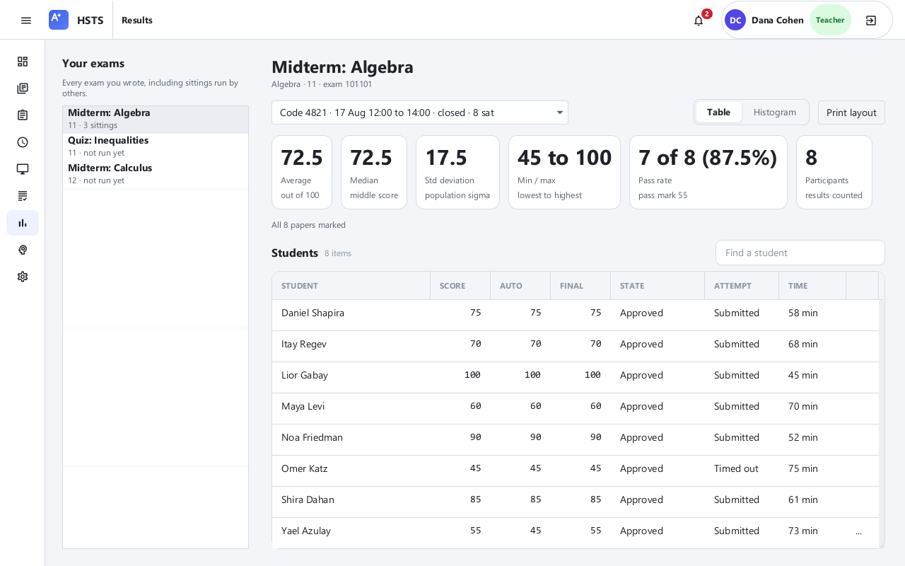
</p>

The full lifecycle, end to end: teachers build a **versioned question bank** and compose exams
manually or **auto-generate** them from topic and difficulty criteria; a **subject coordinator
approves** each exam version against the exact paper a student will see; teachers **release**
approved versions under 4-character codes; students sit exams under a **server-owned timer**
(auto-save on every answer, resume after a crash, forced hand-in at the bell); **grading is
automatic** with teacher review, audited overrides and bulk approval; and every role sees
exactly the statistics it is allowed to see, from a per-sitting histogram with mean/median/±σ
overlays up to a cross-sitting **report engine**. An **AI study bot** answers course questions
from teacher-uploaded material, guard-railed so exam data is structurally unreachable. Every
state change is **pushed**: there is no refresh button anywhere in the application, by
requirement.

---

## A tour of the system

### The teacher's day

| | |
|:---:|:---:|
| 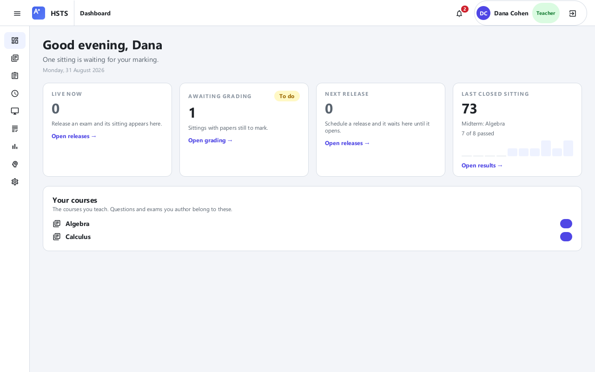 | 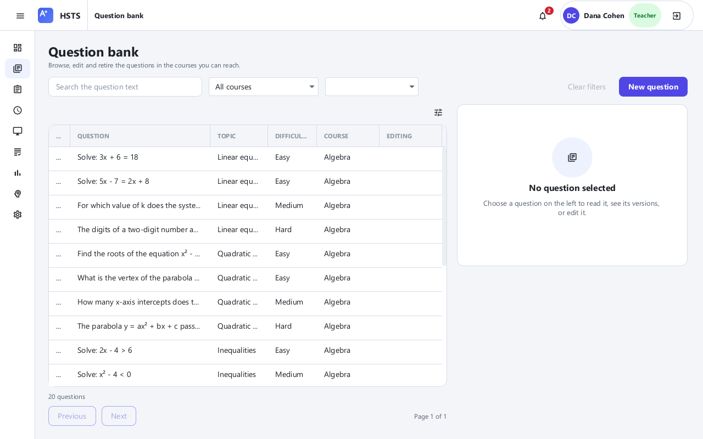 |
| **Dashboard**: live cards for the sitting in progress, papers awaiting marking, the next release, the last closed sitting's pass rate. Every card updates by push. | **Question bank**: filter by course, topic, difficulty or text; every edit creates a new version and the history is one click away; rows show live "being edited by" badges. |
| 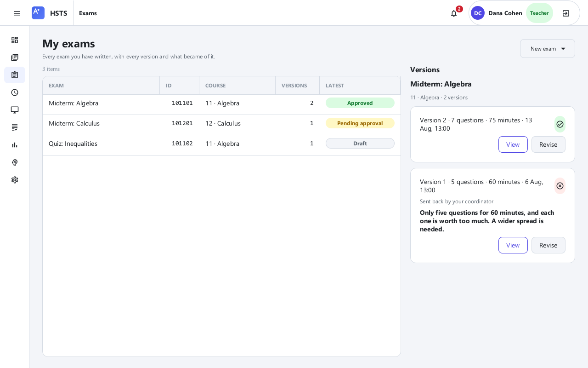 | 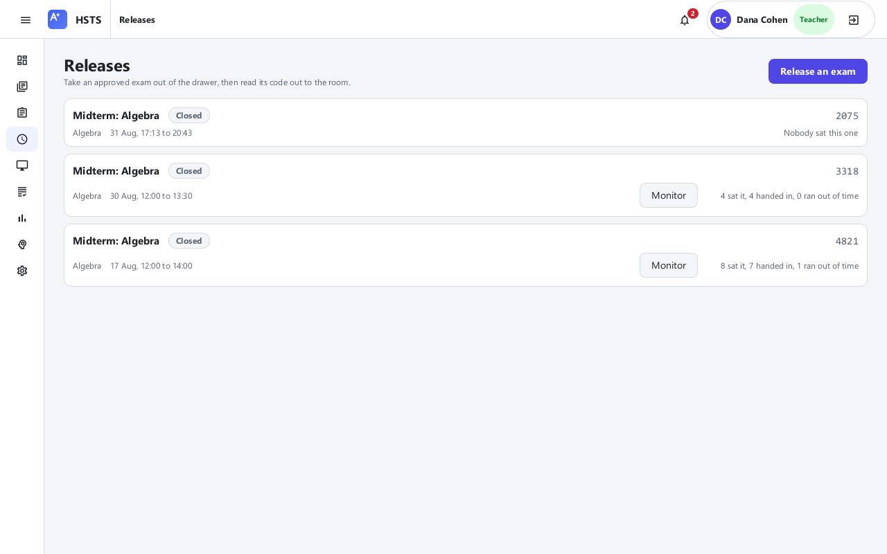 |
| **Exams**: versioned, with state chips (draft, pending, approved, rejected with the coordinator's reason on the card). The builder blocks a save until points sum to exactly 100, and auto-composition reports precisely what the bank cannot satisfy. | **Releases**: the same approved exam can be taken out of the drawer many times, each sitting with its own window, code and statistics; scheduled sittings can be cancelled, live ones closed early. |
| 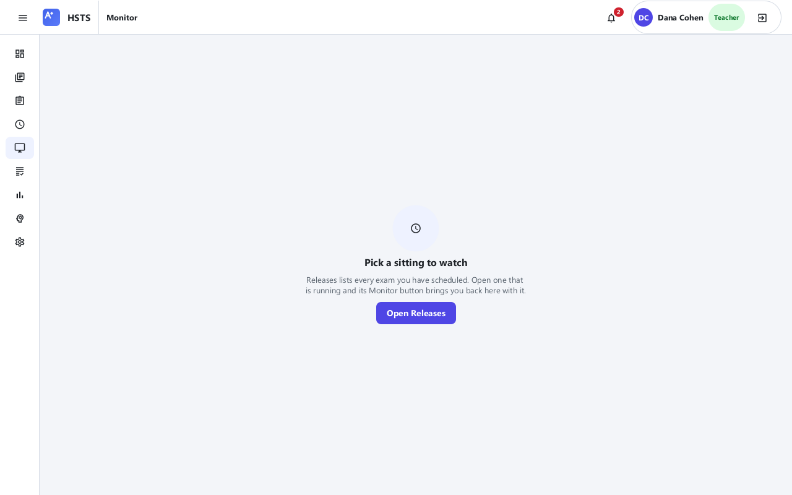 | 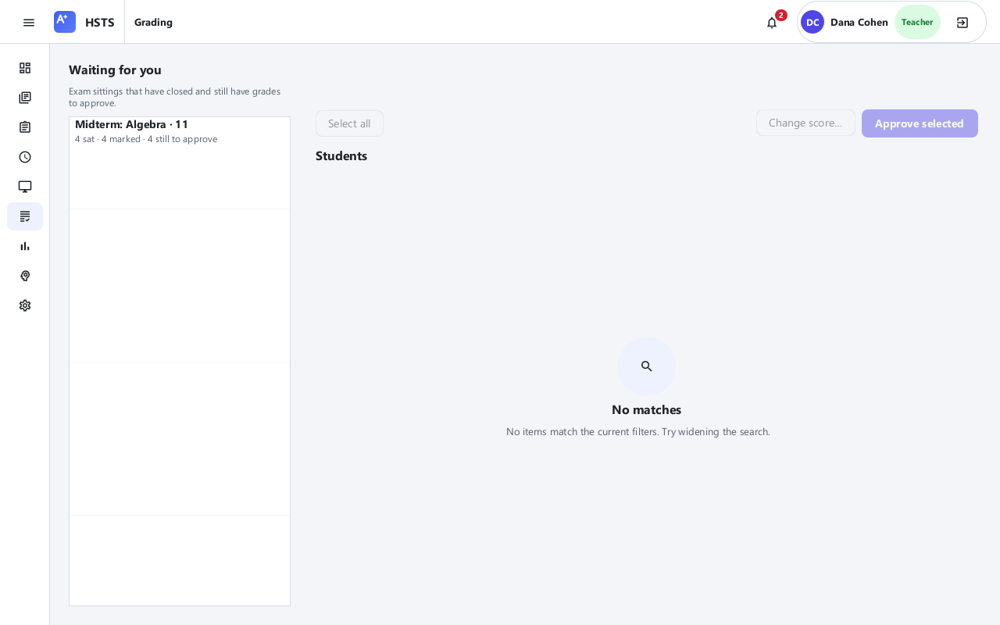 |
| **Live monitor**: who started, who handed in, who timed out, each student's remaining time and attention flags, all pushed as they happen; time extensions land on every sitting student's screen within the second. | **Grading**: auto-scores on submission, per-paper review with the marked answers, score changes only with a recorded justification, bulk approve with a counted confirmation. |

### The student's day

| | |
|:---:|:---:|
| 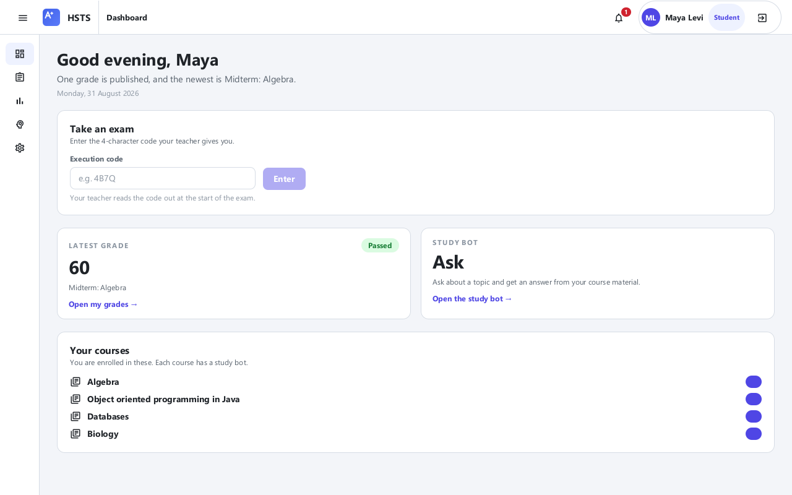 | 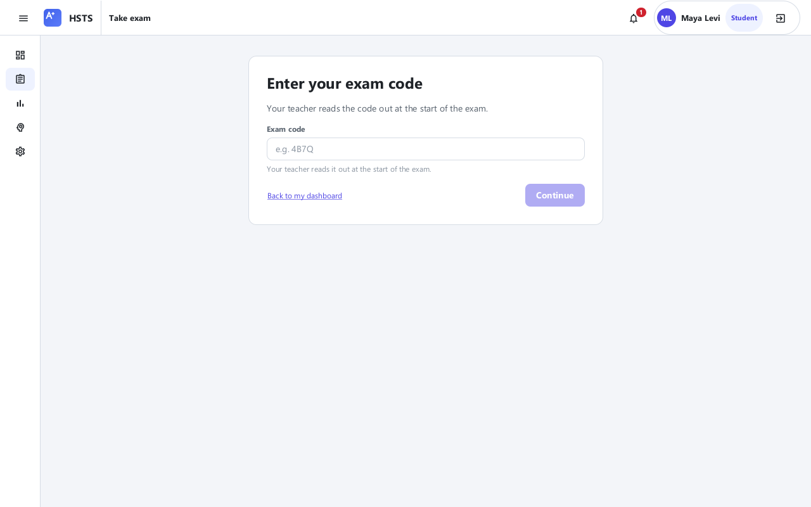 |
| **Dashboard**: courses, the next exam, the code entry card, recent grades. | **Taking an exam**: code, identity check against the student's own ID, then the paper; answers save on every click, a killed client resumes with the correct remaining time, and the bell force-submits whatever is saved. |
| 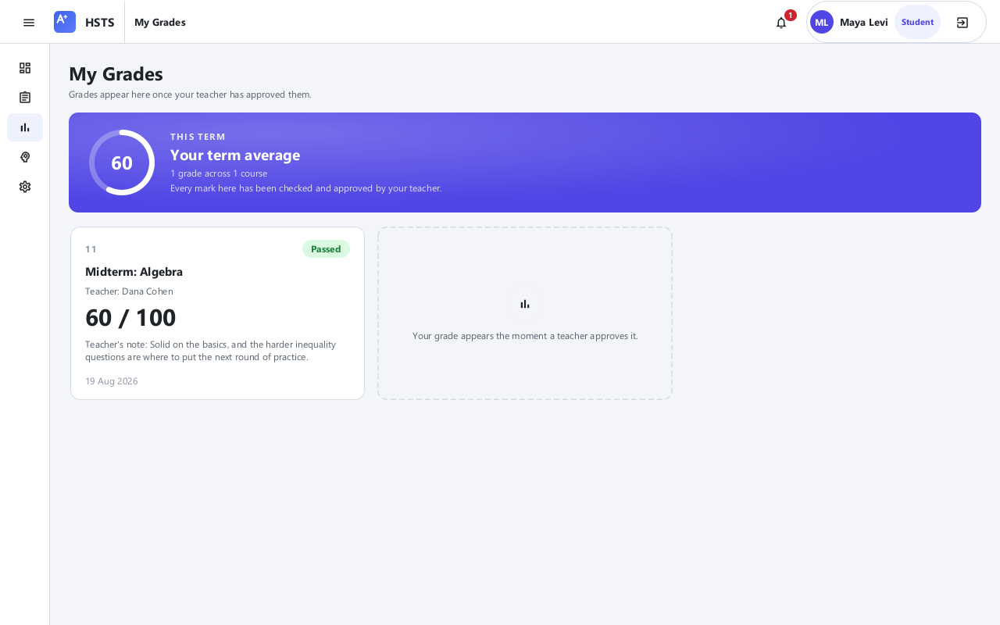 | 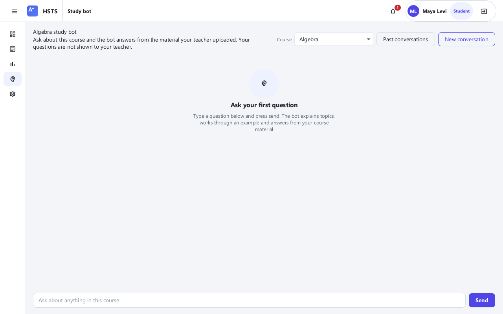 |
| **My grades**: a grade appears the moment the teacher approves it, pushed live, with the checked paper (wrong answers marked, the teacher's note) and a print view. Another student's grade is unreachable server-side, not merely unlinked. | **Study bot**: course-scoped chat over the teacher's uploaded material and the question bank; locked during that course's exam; personal history, reopenable conversations. |

### Coordinator and principal

| | |
|:---:|:---:|
| 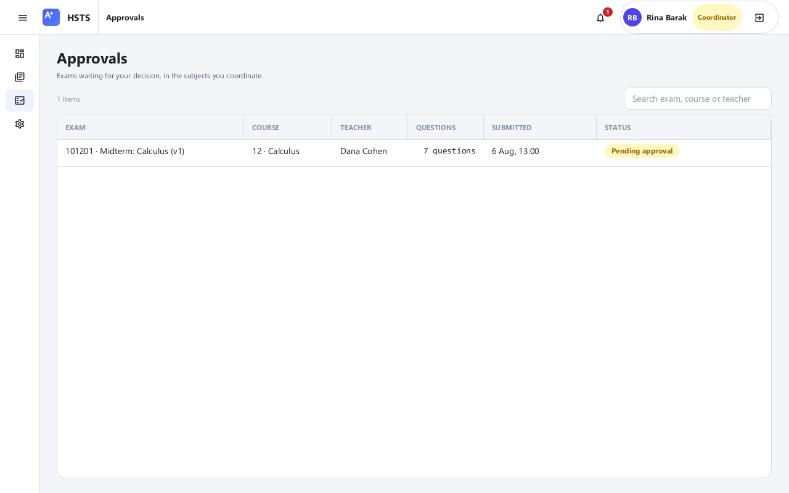 | 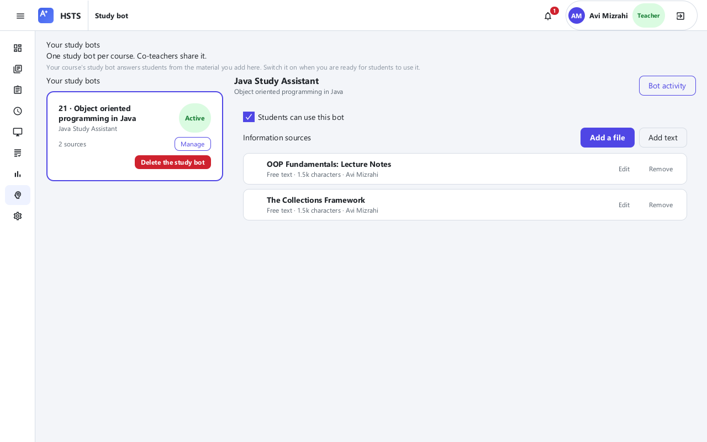 |
| **Approvals**: the pending queue for her subject, each exam opening as the exact paper a student would see plus the teacher-only notes and the answer key; rejection requires a reason and the reason travels back to the author, live. | **Bot manager**: one bot per course, shared by co-teachers; PDF/Word/text sources parsed at upload; edit-locked like everything else; anonymous usage analytics. |
| 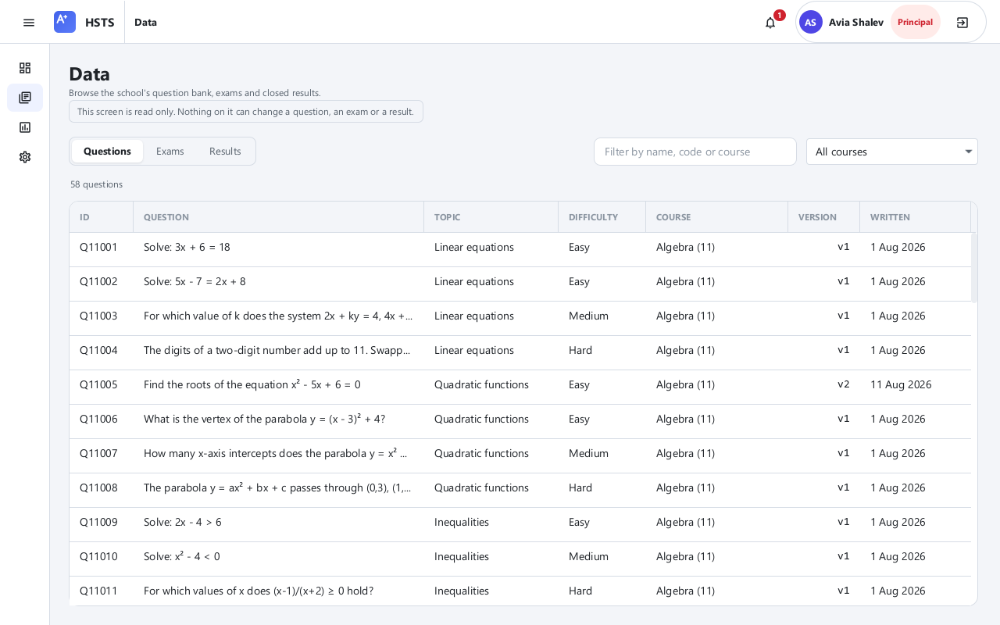 | 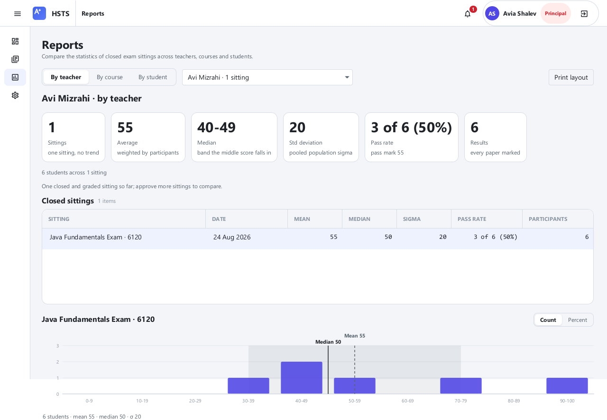 |
| **Principal's data browser**: the whole school's bank, exams and results, read-only by construction: the role is authorized on eight verbs and every one is a read. | **Reports**: average, median and decile distribution compared across the sittings of one teacher, one course or one student; a new report dimension is one Strategy class. |

<p align="center">
  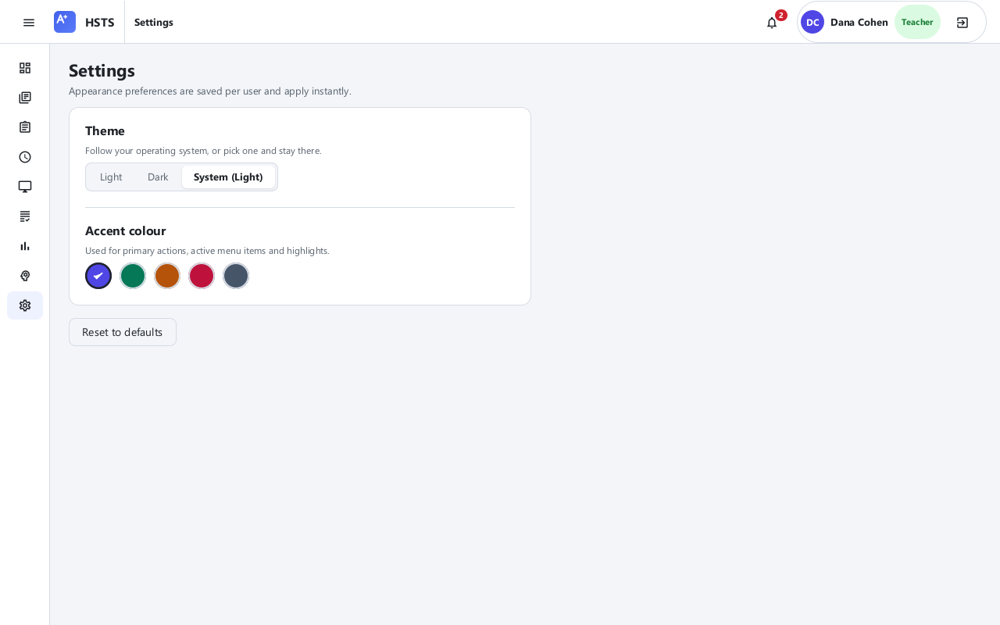
</p>

**The design system**: one component library (tables, chips, dialogs, toasts, skeletons, the
StatChart histogram) reused by all sixteen feature packages; light, dark and follow-OS modes
with five accent palettes, applied live to every open window; every list has an explaining empty
state, every failure a plain-language sentence, every slow operation a progress affordance; a
build-failing guard walks every screen at two window sizes and fails on any truncated text.

---

## Quick start (one machine)

Prerequisites: **JDK 21**, **MySQL 8** (a `root`/`root` default is assumed; change it in
`server.properties`), Maven via the included wrapper.

```bash
# 1. One-time: an empty database (the server migrates it itself on first start)
mysql -u root -p -e "CREATE DATABASE IF NOT EXISTS hsts_db CHARACTER SET utf8mb4 COLLATE utf8mb4_unicode_ci"

# 2. Build both fat JARs
./mvnw -DskipTests clean package        # Windows: .\mvnw -DskipTests clean package

# 3. Terminal 1: the server (opens the server console window; Flyway runs V1..V7 automatically)
java -jar target/hsts-server.jar
#    terminal-only:  java -jar target/hsts-server.jar --headless
#    other flags:    --port <n>   --no-discovery

# 4. Load the demo data: press "Load demo data if missing" once on the server console
#    (or: java -cp target/hsts-server.jar server.db.seed.SeedMain   [--reseed to wipe & reload])

# 5. Terminal 2: a client
java -jar target/hsts-client.jar
```

The client discovers the server by UDP broadcast and lands on Login. Every demo account uses
password **`demo123`**; the roster is in [`docs/DEMO_ACCOUNTS.md`](docs/DEMO_ACCOUNTS.md).
`dana.cohen` (teacher), `rina.barak` (coordinator), `maya.levi` (student) and `principal.avia`
are the four fastest doors in.

## Two machines (the deployment the course grades)

1. Build on both machines from the **same commit**: the wire protocol is serialized Java, and
   mixed builds do not speak.
2. On the server machine: allow TCP 5555 and the discovery UDP port through the firewall
   ([`docs/DEMO_DAY.md`](docs/DEMO_DAY.md) §4.2 has the PowerShell), start the server, and read
   the address and server ID off the console; it prints them large.
3. On the client machine: launch the client; the discovery picker lists the server (name ·
   address · ID). Pick it, or use **change server** and type the address; manual entry is
   always one click away. The first successful connect pins the server's ID, and a changed ID
   later raises an explicit warning (trust-on-first-use).
4. A first connect through a firewall prompt may take a few seconds; the button reads
   "Still trying…" while the dial (bounded at 15 s) works. A dead address fails with a plain
   sentence, never a spinner.

## Configuration

Both JARs read an optional properties file **beside the JAR** (falling back to bundled
defaults):

| File | Keys | Notes |
|---|---|---|
| `client.properties` | `server.host`, `server.port` | The client also remembers the last successful server on its own |
| `server.properties` | `db.user`, `db.password`, `bot.deepseek.key`, `bot.anthropic.key` | **Gitignored.** Bot keys may come from `HSTS_DEEPSEEK_KEY` / `HSTS_ANTHROPIC_KEY` instead (environment wins). A missing key is a supported state: that provider reports unconfigured and the chain moves on; with no provider the bot answers its fallback sentence. Keys exist only on the server, never in the client, never in git. |

## Architecture

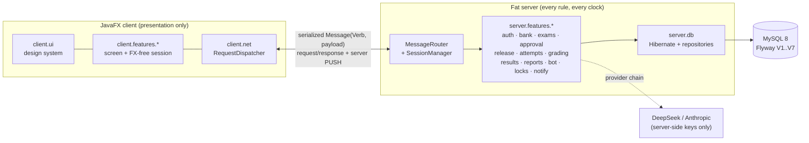

| Tier | Owns | Where |
|---|---|---|
| **Presentation** | Rendering and intent; zero rules | `client.core`, `client.ui`, `client.features.*`, `client.net` |
| **Logic (fat server)** | Every rule, every clock, every authorization | `server.core`, `server.features.*` |
| **Data** | Persistence only | `server.db`: entities, one-query-per-need repositories, Flyway migrations |
| **Common** | Wire types only | `common.protocol`, `common.dto.*` (Serializable records; the student-facing shapes **structurally cannot carry an answer key**) |

What an examiner will ask about, and where it lives: server-authoritative timers with live
extensions; advisory **edit locks** (live badges, heartbeat, optimistic-version backstop);
**immutable versioning** for questions and exams, with released sittings pinned to the version
they were built from; a **Strategy** report engine; a provider-adapter chain for the bot with
structural isolation from exam data; persistent, pushed notifications; UDP discovery with
trust-on-first-use pinning. The full story, including the phase-2 (internet) readiness argument,
is in [`docs/ARCHITECTURE.md`](docs/ARCHITECTURE.md), and every non-obvious decision has its
reasoning in [`docs/DECISIONS.md`](docs/DECISIONS.md).

## Testing

~7,100 tests run in the ordinary build: unit and service tests against **live MySQL**
(Flyway-migrated schemas per run), FX-free session tests, TestFX interaction tests on the real
toolkit (headless Monocle) driving **real gestures** (popup clicks, keyboard traversal), and
guard tests that fail the build on structural drift: answer-key leak guards over the wire
types, a thread-seam guard, icon and copy guards, and a truncation guard that walks every
screen at two window sizes. JaCoCo enforces the coverage gate; GitHub Actions runs the whole
thing against MySQL 8.4 on every push. The screenshots above are captured by a test
(`ScreenshotTourTest`) that drives the real application against the seeded database, headless.

```bash
HSTS_REQUIRE_MYSQL=true ./mvnw clean verify
```

## Repository map

| Path | What |
|---|---|
| `docs/PRD.md` | The requirements, with every course-spec id and every binding ruling |
| `docs/ARCHITECTURE.md` / `docs/DECISIONS.md` | Design and its reasons |
| `docs/TRACEABILITY.md` | Requirement → class → test → acceptance case, with honest statuses |
| `docs/ACCEPTANCE_TESTS.md` | All 21 course scenarios walked; results and the bug ledger (B-1…) |
| `docs/UI-REGISTER.md` | Every finding from manual rounds and code sweeps (U-1…), with root causes |
| `docs/DEMO_WALKTHROUGH.md` | The 21 defence marks as an ordered, copy-paste-ready checklist |
| `docs/DEMO_DAY.md` / `docs/DEMO_SCRIPT.md` / `docs/DEMO_PREP.md` | Machine prep · the narrated demo · who-is-who and paste data |
| `docs/PROBLEMS.md` | Fourteen engineering problems met on the way, each with its root cause and lesson |
| `docs/contracts/` | Frozen wire contracts and their dated amendments |

## Submission build

```bash
./mvnw -Djar.prefix=G12-1 -DskipTests clean package   # G12-1_Server.jar / G12-1_Client.jar
```

## Team - Group 12-1

| Member | Email |
|---|---|
| Naji Kayal | najikayal4@gmail.com |
| Omar Wahbi | omar_w231@outlook.com |
| Amjad Abd Alrahim | aabdel25@campus.haifa.ac.il |
